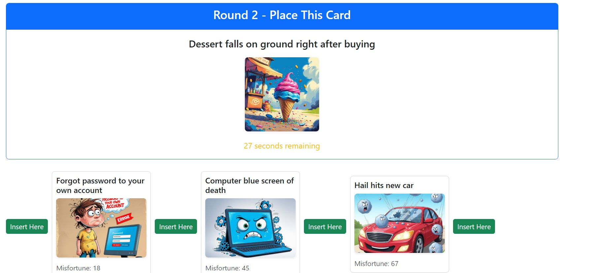
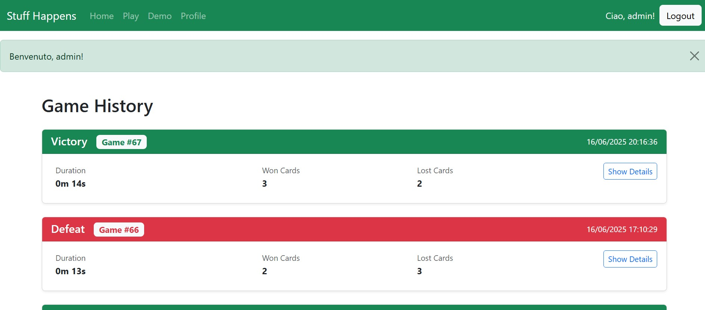

[](https://classroom.github.com/a/uNTgnFHD)
# Exam #N: "Gioco della Sfortuna"
## Student: s349653 MONACO DOROTEA 

## React Client Application Routes

### **Public Routes**
- **`/`** - **Home Page**: Welcome screen with game introduction, rules explanation, and navigation to demo game or login. Shows different content based on authentication status
- **`/game/demo`** - **Demo Game**: Single-round demo game accessible without authentication. Features 30-second timer, 3 initial cards, and one round to test the game mechanics
- **`/login`** - **Login Form**: User authentication page with username/password form (redirects to home if already logged in)

### **Protected Routes** (require authentication)
- **`/game`** - **Authenticated Game**: Full game experience with multiple rounds, score tracking, game history saving, and 30-second timer per round
- **`/history`** - **Game History**: Chronological view of user's completed games with expandable details showing cards won/lost, round information, and game statistics

### **Utility Routes**
- **`/*`** - **404 Not Found**: Catch-all route for invalid URLs displaying a not found page

## API Server

### __User login__

URL: `/api/sessions`

HTTP Method: POST.

Description: Authenticate a user with username and password.

Request body:
```
{
  "username": "testuser",
  "password": "password123"
}
```

Response: `201 Created` (success) or `401 Unauthorized` (wrong credentials). In case of success, returns user data in JSON format.

Response body:
```
{
  "id": 1,
  "username": "testuser"
}
```

### __Get current user info__

URL: `/api/sessions/current`

HTTP Method: GET.

Description: Retrieve information about the currently authenticated user.

Response: `200 OK` (success) or `401 Unauthorized` (not authenticated).

Response body:
```
{
  "id": 1,
  "username": "testuser"
}
```

### __User logout__

URL: `/api/sessions/current`

HTTP Method: DELETE.

Description: Logout the current user.

Response: `200 OK` (success).

Response body: _None_

### __Start demo game__

URL: `/api/games/demo`

HTTP Method: GET.

Description: Start a demo game and retrieve 3 random initial cards.

Response: `200 OK` (success) or `500 Internal Server Error` (generic error).

Response body:
```
[
  {
    "id": 1,
    "name": "Wi-Fi disconnects during video lecture",
    "image": "http://localhost:3001/images/card1.jpg",
    "misfortune": 5,
    "initial": false,
    "won": false
  },
  ...
]
```

### __Get demo round card__

URL: `/api/games/demo/round`

HTTP Method: GET.

Description: Get a random card for the demo game round, excluding specified cards.

Query parameters: `initialCards` (comma-separated list of card IDs to exclude)

Response: `200 OK` (success), `404 Not Found` (no more cards available), or `500 Internal Server Error` (generic error).

Response body:
```
{
  "id": 15,
  "name": "Computer blue screen of death",
  "image": "http://localhost:3001/images/card15.jpg"
}
```

### __Submit demo game guess__

URL: `/api/game/demo/guess`

HTTP Method: POST.

Description: Submit a guess for where to place a card in the demo game.

Request body:
```
{
  "cardId": 15,
  "playerCardIds": [1, 3, 8],
  "insertPosition": 2
}
```

Response: `200 OK` (success), `404 Not Found` (card not found), `422 Unprocessable Entity` (validation error), or `500 Internal Server Error` (generic error).

Response body (correct guess):
```
{
  "correct": true,
  "card": {
    "name": "Computer blue screen of death",
    "image": "http://localhost:3001/images/card15.jpg",
    "misfortune": 45
  }
}
```

Response body (incorrect guess):
```
{
  "correct": false,
  "correctPosition": 1
}
```

### __Start new authenticated game__

URL: `/api/games/new`

HTTP Method: POST.

Description: Start a new game for authenticated users.

Authentication: Required.

Response: `200 OK` (success), `401 Unauthorized` (not authenticated), or `500 Internal Server Error` (generic error).

Response body:
```
[
  {
    "id": 2,
    "name": "Phone battery at 1% when leaving home",
    "image": "http://localhost:3001/images/card2.jpg",
    "misfortune": 12
  },
  ...
]
```

### __Get authenticated game round card__

URL: `/api/games/<gameId>/round`

HTTP Method: GET.

Description: Get a card for a new round in an authenticated game.

Authentication: Required.

Query parameters: `initialCards` (comma-separated list of card IDs to exclude)

Response: `200 OK` (success), `401 Unauthorized` (not authenticated), `404 Not Found` (no more cards), or `500 Internal Server Error` (generic error).

Response body:
```
{
  "id": 20,
  "name": "Forgot password to your own account",
  "image": "http://localhost:3001/images/card20.jpg"
}
```

### __Submit authenticated game guess__

URL: `/api/games/<gameId>/guess`

HTTP Method: POST.

Description: Submit a guess for card placement in an authenticated game.

Authentication: Required.

Request body:
```
{
  "cardId": 20,
  "playerCardIds": [2, 7, 12],
  "insertPosition": 1
}
```

Response: `200 OK` (success), `401 Unauthorized` (not authenticated), `404 Not Found` (card not found), `422 Unprocessable Entity` (validation error), or `500 Internal Server Error` (generic error).

Response body: Same format as demo game guess.

### __End game__

URL: `/api/games/<gameId>/end`

HTTP Method: POST.

Description: End a game and save the results.

Authentication: Required.

Request body:
```
{
  "startTime": "2025-06-15T10:30:00.000Z",
  "endTime": "2025-06-15T10:35:30.000Z",
  "result": "win"
}
```

Response: `201 Created` (success), `401 Unauthorized` (not authenticated), `422 Unprocessable Entity` (validation error), or `500 Internal Server Error` (generic error).

Response body:
```
{
  "gameId": 123
}
```

### __Get user games__

URL: `/api/games`

HTTP Method: GET.

Description: Retrieve all games played by the authenticated user.

Authentication: Required.

Response: `200 OK` (success), `401 Unauthorized` (not authenticated), or `500 Internal Server Error` (generic error).

Response body:
```
[
  {
    "id": 123,
    "userId": 1,
    "startTime": "2025-06-15T10:30:00",
    "endTime": "2025-06-15T10:35:30",
    "result": "win"
  },
  ...
]
```

### __Get game cards__

URL: `/api/games/<gameId>/cards`

HTTP Method: GET.

Description: Get all cards associated with a specific game.

Authentication: Required.

Response: `200 OK` (success), `401 Unauthorized` (not authenticated), or `500 Internal Server Error` (generic error).

Response body:
```
[
  {
    "gameCard": {
      "id": 1,
      "gameId": 123,
      "cardId": 2,
      "round": null,
      "initial": 1,
      "won": null
    },
    "card": {
      "id": 2,
      "name": "Phone battery at 1% when leaving home",
      "image": "http://localhost:3001/images/card2.jpg",
      "misfortune": 12
    }
  },
  ...
]
```

### __Add card to game__

URL: `/api/games/<gameId>/cards`

HTTP Method: POST.

Description: Add a card to a game (track card in specific round).

Authentication: Required.

Request body:
```
{
  "cardId": 15,
  "round": 3,
  "initial": false,
  "won": true
}
```

Response: `201 Created` (success), `401 Unauthorized` (not authenticated), `422 Unprocessable Entity` (validation error), or `500 Internal Server Error` (generic error).

Response body:
```
{
  "gameCardId": 45
}
```

## Database Tables

- Table `USER` - Contains user authentication information
  - `id` (INTEGER PRIMARY KEY): Unique user identifier
  - `username` (TEXT UNIQUE): User's login name
  - `password_hash` (TEXT): Hashed password for security
  - `salt` (TEXT): Salt used for password hashing

- Table `CARD` - Contains disaster cards used in the game
  - `id` (INTEGER PRIMARY KEY): Unique card identifier
  - `name` (TEXT): Card name/description of the disaster
  - `image_path` (TEXT): Path to the card's image file
  - `misfortune_index` (REAL UNIQUE): Misfortune level (1-100) used for ordering cards

- Table `GAME` - Contains information about completed games
  - `id` (INTEGER PRIMARY KEY): Unique game identifier
  - `user_id` (INTEGER): Foreign key referencing USER table
  - `start_time` (DATETIME): When the game started
  - `end_time` (DATETIME): When the game ended
  - `result` (TEXT): Game outcome ('win' or 'lose')

- Table `GAME_CARD` - Contains cards used in each game round
  - `id` (INTEGER PRIMARY KEY): Unique game-card association identifier
  - `game_id` (INTEGER): Foreign key referencing GAME table
  - `card_id` (INTEGER): Foreign key referencing CARD table
  - `round_number` (INTEGER): Round number when card was played (NULL for initial cards)
  - `is_initial` (BOOLEAN): Whether this was an initial card (1) or played card (0)
  - `won` (BOOLEAN): Whether the player won (1) or lost (0) this card (NULL for initial cards)

## Main React Components

- `DefaultLayout` (in `DefaultLayout.jsx`): Main application wrapper that provides consistent layout structure with navigation bar, message handling, and content area for all pages
- `HomePage` (in `HomePage.jsx`): Landing page component that displays welcome message, game rules, and navigation buttons to different game modes based on authentication status
- `GameDemo` (in `GameDemo.jsx`): Demo game implementation with single-round gameplay, 30-second timer, card placement logic, and tutorial-style experience for non-authenticated users
- `GamePage` (in `GamePage.jsx`): Full authenticated game component with multiple rounds, comprehensive timer management, score tracking, game result saving, and round-by-round progression
- `HistoryPage` (in `HistoryPage.jsx`): Game history viewer with expandable accordion interface showing completed games, detailed statistics, and individual card information with round numbers
- `AuthComponents` (in `AuthComponents.jsx`): Contains LoginForm component for user authentication with form validation, error handling, and credential submission
- `NavHeader` (in `NavHeader.jsx`): Navigation bar component that displays authentication status, user information, and provides navigation links to different application sections

(only _main_ components, minor ones may be skipped)

## Screenshot




## Users Credentials

- dory1502, password 
- admin, password 
